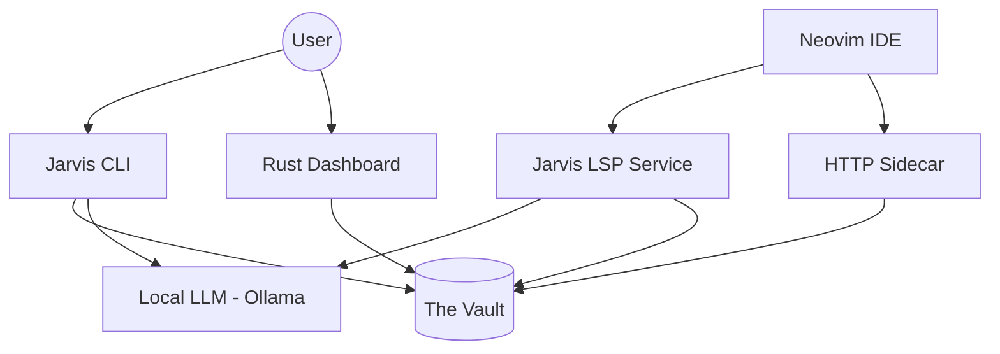

# Jarvis Architecture (V3)

Jarvis is a distributed-agent orchestrator optimized for local-first execution. This document describes the internal subsystems and their interactions.

## 1. System Overview

## 2. Core Subsystems

### A. Security Enforcement (`lib/security/`)
The foundation of Jarvis. Implements **Capability-Based Access Control (CBAC)**.
- **SecurityContext**: Tracks an `agent_id`, `trust_level` (0-4), and active `CapabilityGrant` objects.
- **CapabilityGrantManager**: The gatekeeper. Handles interactive prompts for CLI and OOB (out-of-band) approvals for IDE sessions.
- **AuditLogger**: Records every grant, denial, and expiration to `security_audit.db`.
- **Capability Management**: Managed via `jarvis cap` (see **[Usage Guide](USAGE.md)**).

### B. External Reasoning System (ERS) (`lib/ers/`)
Provides a pipeline for multi-step intelligence using YAML-defined chains.
- **Chains**: Sequential or parallel steps with Jinja2 templates.
- **Augmentor**: Executes steps, handles per-step capability requests, and enforces RAM gates to prevent system crashes on limited hardware.

### C. Model Hub (`lib/models/`)
A unified abstraction layer for LLM providers.
- **ModelRouter**: Resolves human-readable aliases (e.g., `coder`, `reason`) to specific model specs.
- **Adapters**: Provider-specific logic for Ollama (local) and various cloud APIs (Anthropic, OpenAI, etc.).
- **Fallback Engine**: Automatically downgrades or upgrades models based on availability and capability floor.
- **Model Overview**: See **[Models Overview](MODELS_OVERVIEW.md)** for technical specs.

### D. IDE Bridge (`services/jarvis_lsp.py`)
A custom Language Server Protocol (LSP) and FastAPI sidecar.
- **Session Isolation**: Each Neovim window receives a unique `conn_id` and a child `SecurityContext` cloned from the primary CLI session.
- **Long-Polling**: Enables the IDE to receive security approval notifications asynchronously without blocking the UI thread.

## 3. Data Flow & Isolation

### Principle of Least Privilege
Jarvis uses **Recursive Security Contexts**. When an ERS chain starts a step, it doesn't run with the full session's permissions. Instead, it creates a "Task-Scoped" child context that exists only for that step's duration. All grants are automatically revoked in the `finally` block of the step execution.

### Vault Security
The Vault at `/THE_VAULT/jarvis/` is the only directory where databases and secrets are stored. 
- Databases use `PRAGMA journal_mode=WAL` for concurrent access.
- Secrets are AES-256 encrypted using a keyring stored in the Vault.
