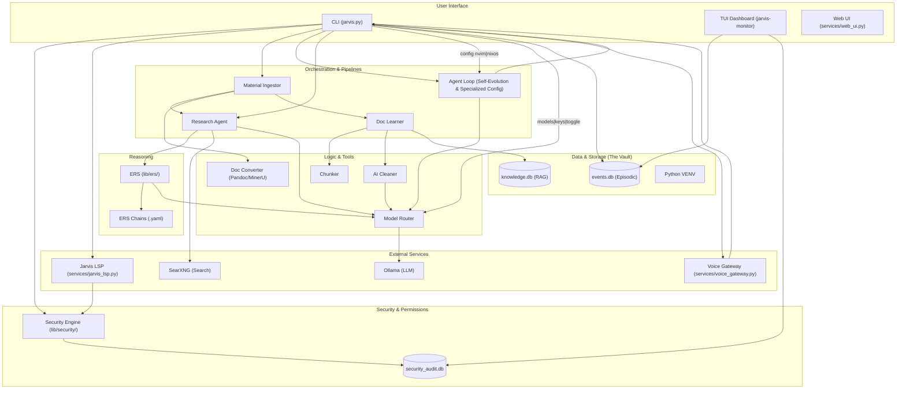

# Jarvis System Architecture

This document provides a high-level overview of the Jarvis AI Orchestrator's internal structure and data flow.

## UML Component Diagram

## Component Descriptions

| Component | Responsibility |
|-----------|----------------|
| **jarvis.py** | Main entry point, intent classification, safety confirmation, and command routing. Now handles model/key management and voice toggling. |
| **Material Ingestor** | Orchestrates research and automated ingestion of coding materials (books/docs). |
| **Doc Learner** | Handles the ingestion of URLs and local files into the knowledge base (3-Layer Architecture). Includes automatic chunking for large docs. |
| **Agent Loop** | A self-correcting orchestrator for complex tasks, autonomous self-improvement, and specialized config editing (nvim/nixos). |
| **Doc Converter** | Uses Pandoc and MinerU (magic-pdf) for high-fidelity Markdown extraction. |
| **Knowledge Manager** | Manages the multi-layered SQLite knowledge base for RAG. |
| **Model Router** | Maps specific AI tasks (summarize, reason, clean) to the best-fit local LLM. Manages model aliases and keep-alive strategy. |
| **Voice Gateway** | Translates voice commands to CLI actions via Whisper.cpp. Respects user-toggled preferences. |
| **Security Engine** | Enforces capability-based least privilege. Includes AuditLogger and GrantManager. |
| **ERS** | External Reasoning System. Orchestrates multi-step chained reasoning via YAML schemas. |
| **Jarvis LSP** | The Antigravity IDE bridge. Provides AI features to Neovim via TCP (8002) and OOB security via HTTP (8001). |
| **The Vault** | High-capacity storage for databases, virtual environments, and intermediate files (Unified with main repo on SSD). |

## Data Flow: Material Indexing
1. User provides a topic via CLI.
2. **Material Ingestor** triggers **Research Agent** to find strategies/sources.
3. User confirms findings.
4. User places files in `~/Downloads/JarvisMaterials`.
5. **Ingestor** detects file type, uses **Doc Converter** if needed, and calls **Doc Learner**.
6. **Doc Learner** chunks, cleans, and stores content in **knowledge.db**.
